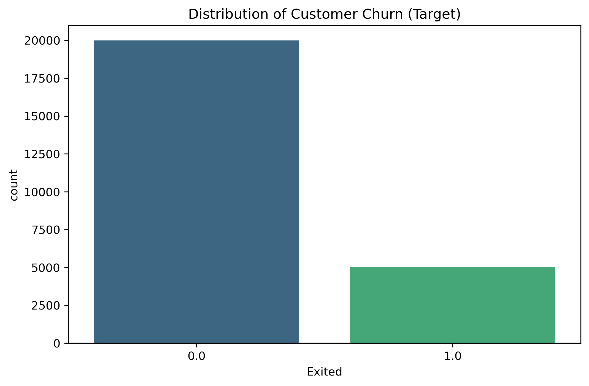
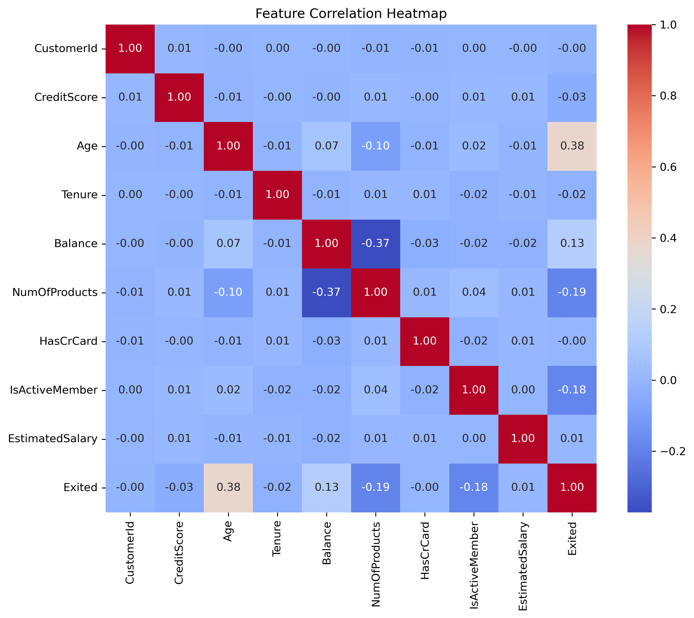
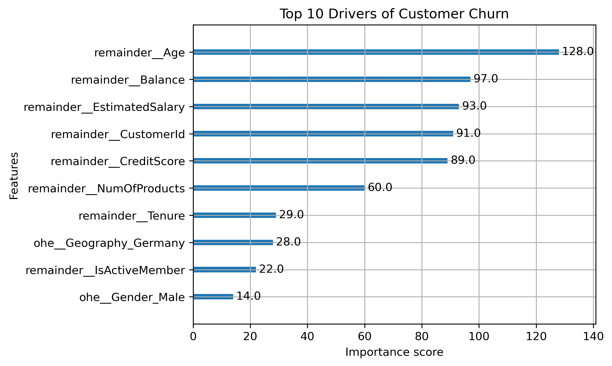
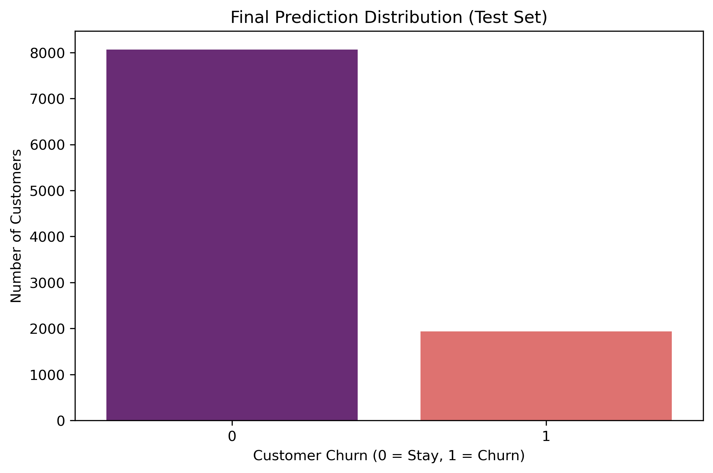

# 🏦 Bank Customer Churn Prediction: Multi-Model Ensemble Approach

> **Project Goal:** To minimize customer attrition by building a high-precision predictive system using a **Soft-Voting Ensemble** of Gradient Boosting Decision Trees (GBDT).

---

## 📖 Project Overview
This project addresses the critical business challenge of customer churn in the banking sector. By evolving from a baseline comparison to a **sophisticated ensemble pipeline (XGBoost, CatBoost, LightGBM)**, I achieved a **0.92 ROC-AUC score**, providing actionable insights for proactive retention strategies.

---

## 🛠 Tech Stack
* **Language:** Python
* **Machine Learning:** XGBoost, CatBoost, LightGBM, Soft-Voting Ensemble
* **Libraries:** Scikit-learn, Pandas, NumPy, Matplotlib, Seaborn

---

## 💡 Key Engineering Decisions

* **Strategic Data Augmentation:** Merged the competition dataset with original "Churn Modelling" data to enhance model robustness and pattern recognition.
* **Professional Preprocessing Pipeline:** Implemented a `ColumnTransformer` workflow with `OneHotEncoder` to ensure seamless, leakage-free transitions between training and test environments.
* **Soft-Voting Ensemble Strategy:** Leveraged the unique strengths of three industry-leading algorithms to maximize generalization:
    * **XGBoost:** Precise linear relationship mapping.
    * **CatBoost:** Advanced categorical feature handling.
    * **LightGBM:** Efficient leaf-wise growth for complex patterns.

---

## 📊 Exploratory Data Analysis (EDA)

Understanding the data distribution is the first step in our predictive modeling.

* **Insight:** The dataset shows a ~20% churn rate. This imbalance informed the choice of **ROC-AUC** as our primary metric and the use of weighted loss functions.

* **Insight:** Correlation analysis identified **Age** ($0.38$) as the primary driver of churn, showing a significant positive relationship. Along with **Balance** and **NumOfProducts** ($-0.37$), these key variables guided the feature selection to prioritize the most predictive behavioral patterns for the ensemble model."

---

## 📈 Model Analysis & Insights

### 1️⃣ Performance Summary
The ensemble model demonstrates excellent discriminative power, balancing precision and risk detection.

| Metric | Score | Professional Interpretation |
| :--- | :--- | :--- |
| **ROC-AUC** | **0.9193** | **Exceptional** ability to distinguish churners from loyal customers. |
| **Recall (Class 1)** | **0.69** | Successfully captured **69% of actual churners**, reducing missed risks. |
| **F1-Score** | **0.81** | Robust balance between Precision and Recall. |

### 2️⃣ Deep Dive Analysis

* **Strategic Insight:** With a **93% True Negative rate**, the model ensures loyal customers are not wrongly targeted with unnecessary retention costs, while the **0.69 Recall** provides a strong foundation for engagement.

* **Primary Driving Factors**: **Age** ($0.38$) emerged as the most critical predictor of churn, indicating that older customer segments require urgent retention focus. Combined with **Balance** and **Estimated Salary** metrics, these insights enable the bank to execute precision marketing aimed at protecting its most profitable, high-value demographic segments.

* **Actionable Output:** The model flagged **19.37%** of the test population as high-risk, providing a manageable and realistic target list for the bank's retention team.

---
* **Project Origin**: This project was developed as a final project for the Department of AI at Korea National Open University (KNOU) in December 2025.
* **Note on Dataset**: The dataset used in this project is not included in this repository as it was provided for academic purposes (KNOU Coursework).
* **Acknowledgment:** Code optimization, English terminology refactoring, and Technical documentation for this project were supported by **Google Gemini**.
