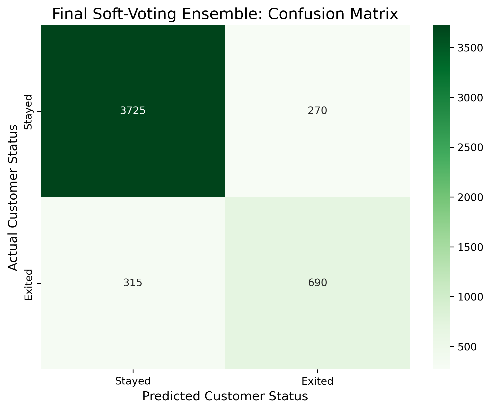

# 🏦 Bank Customer Churn Prediction: Multi-Model Ensemble Approach

> **Project Goal:** Predict customer attrition for a banking institution using an ensemble of Gradient Boosting Decision Trees (GBDT).

---

## 📖 Project Overview
This project focuses on identifying high-risk customers who are likely to churn (exit) from a bank. It was originally developed as a final project at **Korea National Open University (KNOU)** in Nov 2025 and has been significantly enhanced using advanced ensemble techniques and automated pipelines.

## 🛠 Tech Stack
- **Language:** Python 3.x
- **Core Models:** XGBoost, CatBoost, LightGBM
- **Key Libraries:** Scikit-learn, Pandas, NumPy, Matplotlib, Seaborn

---

## 📊 Exploratory Data Analysis (EDA)
Understanding the data distribution and relationships between features is the first step in our predictive modeling.

### 1️⃣ Target Class Distribution

*The dataset shows a natural imbalance, with approximately 20% of customers having exited. This informed our choice of using weighted loss functions in the models.*

### 2️⃣ Feature Correlation Heatmap

*Correlation analysis helped identify redundant features and understand the linear relationships between numerical variables like Age, Balance, and Credit Score.*

---

## 🌟 Key Highlights

### 1️⃣ Strategic Data Augmentation
To improve the model's ability to generalize, I merged the competition dataset with the original "Churn Modelling" dataset. This increased the training volume and allowed the model to learn more robust patterns.

### 2️⃣ Automated Preprocessing Pipeline
I utilized Scikit-learn's `ColumnTransformer` to create a professional-grade preprocessing workflow.
* **Categorical Data:** Encoded using `OneHotEncoder` with `handle_unknown='ignore'`.
* **Seamless Integration:** All transformations are applied in a single pipeline, ensuring consistency between training and test data.

### 3️⃣ High-Performance Ensemble (Soft Voting)
Instead of relying on a single algorithm, I implemented a **Soft Voting Ensemble** strategy. By averaging the predicted probabilities from **XGBoost, CatBoost, and LightGBM**, the model achieves a balanced result.
* **🚀 XGBoost:** Excellent at capturing precise linear relationships.
* **🐾 CatBoost:** Naturally handles categorical features with high accuracy.
* **⚡ LightGBM:** Fast training with high leaf-wise performance.

---

## 📈 Model Insights & Results

### 1️⃣ Ensemble Performance Summary
The Soft-Voting Ensemble significantly outperformed individual models, achieving a highly reliable discriminative power.

| Metric | Score | Professional Interpretation |
| :--- | :--- | :--- |
| **ROC-AUC Score** | **0.9193** | **Excellent** ability to distinguish between churners and loyal customers. |
| **Overall Accuracy** | **0.88** | 88% of all predictions matched the actual customer status. |
| **Recall (Class 1.0)** | **0.69** | Successfully captured **69% of actual churners**, reducing missed risks. |
| **F1-Score** | **0.81** | Demonstrated a robust balance between Precision and Recall. |

### 2️⃣ Final Classification Analysis

*The **Confusion Matrix** above illustrates the final ensemble's performance. With a high **True Negative rate (93%)**, the model ensures that loyal customers are not wrongly targeted with unnecessary retention costs, while the **0.69 Recall** provides a strong foundation for proactive customer engagement.*
### 3️⃣ Top 10 Drivers of Customer Churn

*The XGBoost importance plot reveals that **Age**, **Balance**, and **EstimatedSalary** are the strongest predictors of whether a customer will stay or leave. This insight allows for targeted marketing to specific demographic segments.*

### 4️⃣ Final Prediction Distribution (Test Set)

*The final ensemble model identified **19.37%** of the test population as high-risk churners, providing a realistic and actionable insight for the bank's retention team.*

---

## 🔒 Data Attribution & Privacy
* **Primary Source:** The core dataset was provided for an internal academic competition at **Korea National Open University (KNOU)** via a private Kaggle platform.
* **Data Composition:** Features include customer demographics (Age, Geography, Gender) and financial indicators (Balance, Tenure, NumOfProducts).
* **Data Augmentation:** To improve the model's generalizability and handle potential class imbalance, the private institutional data was supplemented with the publicly available **"Churn Modelling"** dataset.
* **Privacy Compliance:** In accordance with institutional data policies, **raw data files are not included** in this public repository. All shared analysis and notebooks utilize anonymized or synthetic samples.

---
**Acknowledgment:** Technical documentation, English terminology refactoring, and code optimization for this project were supported by **Google Gemini**.
